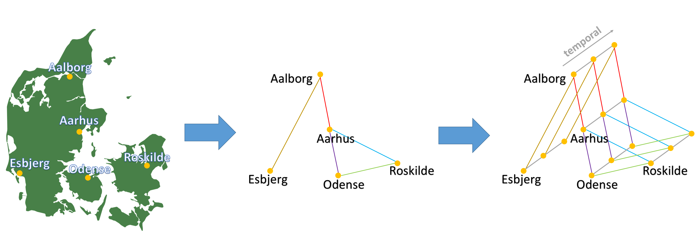
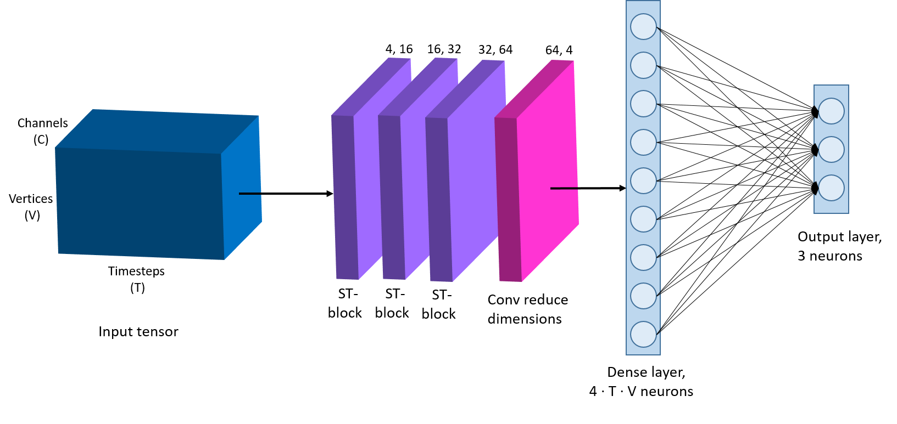

# WeatherGCNet

Implementation code for the paper: "Deep Graph Convolutional Networks for Wind Speed Prediction" [[LINK](https://www.esann.org/sites/default/files/proceedings/2021/ES2021-25.pdf)].

<p align="center"></p>
<p align="center"></p>

## Installation
Clone the repository with git:
```
git clone https://github.com/tstanczyk95/WeatherGCNet.git
```
Install the required packages via command line or terminal:
```
pip install -r requirements.txt
```

## Data
Download the required datasets:
*   Danish dataset, from [here](https://drive.google.com/drive/folders/1dqtmmfyKg5X2aCa2W8pBvPCrxE7Tc974?usp=sharing) (input timestep (time lag) 30, derived from the dataset from [here](https://sites.google.com/view/siamak-mehrkanoon/code-data)),
*   Dutch dataset, from [here](https://github.com/HansBambel/multidim_conv) (`Wind_data_NL`).

## Usage
Navigate to the desired combination, e.g. `NL wind speed forecasting/WeatherGCNet with gamma`. 
### Training
Use `train_model.py` to train the corresponding model. E.g.:
```
python train_model.py --dataset_path data/dataset.pkl --epochs 50 --input_timesteps 30 --predict_timesteps 2
```
For more information about the usage, type:
```
python train_model.py --help
```
The usage is slightly different for Dutch and Danish dataset (use the `--help` option to see more).<br/><br/>
The trained model with the lowest validation loss will be saved in a fromat including date-time information: `best_model_nl_date_YYYYMMDD_hhmmss.pt`.
Summary with test MAE and MSE of the saved model will be provided at the end of the run.
### Testing
The trained models (input timestep 30) with weights are provided in `trained_models`, e.g. `2h_pred_model.pt`. Use `test_model.py` to test a trained model. **Ensure the correctness of the parameters with respect to the trained model.** E.g.:
```
python test_model.py --dataset_path data/dataset.pkl --input_timesteps 30 --predict_timesteps 2 --model_path trained_models/2h_pred_model.pt
```
For more information about the usage, type:
```
python test_model.py --help
```
Analogously, summary with test MAE and MSE of the tested model will be provided at the end of the run.

## Citation
```
@article{stanczyk2021weathergcnet,
  title={Deep Graph Convolutional Networks for Wind Speed Prediction},
  author={Stańczyk, Tomasz and Mehrkanoon, Siamak},
  year={2021}
}
